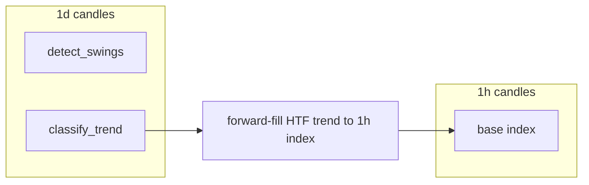

# Phase 4 High Level Design — Market Structure Detection

**Status:** Approved — ready for implementation (Q&A locked 2026-06-06)  
**Prerequisite:** Phase 3 complete ([PHASE_3_HLD.md](PHASE_3_HLD.md))  
**Next phase after this:** [Phase 5 — Pattern Recognition](ROADMAP.md#phase-5--pattern-recognition)

---

## Why Phase 4 Matters

Phase 4 is the **structural foundation** for everything that depends on price geometry:

| Downstream phase | Depends on Phase 4 for |
|---|---|
| Phase 5 — Patterns | Double tops, H&S, triangles need swing anchors |
| Phase 5c — Divergence | Compare indicator peaks to **price swing** peaks |
| Phase 6 — SMC | BOS/CHOCH, liquidity sweeps need swing highs/lows |
| Phase 8 — DSL / UI | “Daily trend up, enter on 1h pullback” needs HTF structure |

Indicators (Phase 2) answer **“what is RSI?”**  
Market structure answers **“where are the meaningful highs and lows, and what is trend?”**

Getting this wrong poisons patterns, SMC, and multi-timeframe strategies. Phase 4 is
isolated so it can be iterated and validated before pattern logic is attempted.

---

## Starting Point

Phase 3 delivers a trustworthy backtest engine. Phase 4 adds a **new layer** — it does
not change `get_candles()`, the indicator registry, or the backtest engine.

**What exists today (relevant):**

| Module | What it is | Phase 4 relationship |
|---|---|---|
| `indicators/custom/pivots.py` | **Floor pivots** (PIVOT_P, R1, S1) from prior session H/L/C (D-35) | **Not** swing structure — keep separate |
| `indicators/registry.py` | 58 OHLCV indicators | Unchanged in Phase 4 core |
| `signals/evaluator.py` | Indicator + AND + compare conditions | **Unchanged** in Phase 4 (D-63) |
| `data/loader.py` | `get_candles(symbol, tf, start, end)` | Used for multi-TF structure reads |
| `structure/` | — | **New package** (this phase) |

**No `structure/` code exists yet.** Phase 4 starts from zero in that package.

---

## Phase 4 Goal

**Given OHLCV candle data, reliably detect swing highs/lows, label trend structure (HH/HL/LH/LL),
derive support/resistance from swings, classify trend per timeframe, and expose multi-timeframe
context for later signal conditions.**

**Done when:**

1. Swing detection is implemented, tested, and documented (algorithm + parameters).
2. HH/HL/LH/LL labeling works with configurable equal-high/low tolerance.
3. Trend classification (`uptrend` / `downtrend` / `range` / `undefined`) is per-bar or per-swing.
4. S/R levels are derived from recent swings (not session floor pivots).
5. Multi-timeframe structure can be computed for at least two timeframes and aligned to a base TF.
6. A validation path exists (tests + export for manual chart review on BTC/USDT).
7. Phase 5 can consume swing lists without re-implementing detection.

**Explicitly out of scope for Phase 4**

- Classical chart patterns (Phase 5)
- Candlestick patterns / TA-Lib `CDL*` (Phase 5a)
- Divergence detection (Phase 5c) — but swing output must support it
- SMC (BOS, CHOCH, FVG, order blocks) — Phase 6
- Fibonacci retracement/extensions (needs anchors — may use swings in Phase 5+)
- ZigZag indicator (deferred — see D-54)
- VPVR / volume profile
- ML / vectorbt PRO template matching — **deferred to Phase 5** (D-61); not Phase 4
- Full DSL for structure conditions (OQ-23 — Phase 8); Phase 4 ships **library + minimal hooks**
- Backtest engine changes
- Storing structure in the database (compute on demand like indicators — D-07)

---

## Locked Decisions (carry forward)

| ID | Decision | Phase 4 impact |
|---|---|---|
| D-06 | `get_candles()` is the only data boundary | HTF candles loaded via loader, not SQL in structure code |
| D-07 | Pure functions, no DB side effects | All structure functions take DataFrame/Series in memory |
| D-08 | Signals are structured dicts | HTF references are data in the dict, not code |
| D-14 | Next-bar open fills | Structure used for signals must respect **confirmed** swings only in backtests |
| D-35 | Session floor pivots | Stays in `indicators/`; not replaced by swing S/R |
| D-61 | Pivot structure only in Phase 4 | No vectorbt-style similarity; that is Phase 5 |

---

## Feature Catalog (ROADMAP → implementation plan)

| # | Feature | Phase 4 deliverable |
|---|---|---|
| 1 | Swing highs / lows | `detect_swings(ohlcv, left, right) -> list[SwingPoint]` |
| 2 | HH / HL / LH / LL labels | `label_swings(swings, tolerance) -> list[LabeledSwing]` |
| 3 | Equal highs / equal lows | Tolerance-aware comparison (OQ-11) |
| 4 | Trend classification | `classify_trend(swings) -> pd.Series` of trend enum |
| 5 | S/R from swings | `swing_support_resistance(swings, k) -> StructureLevels` |
| 6 | Multi-TF structure | `build_structure_context(symbol, base_tf, htf_list, start, end)` |
| 7 | Confirmed vs provisional swings | No lookahead in backtest path (OQ-45) |
| 8 | Validation export | CSV/JSON of swings + optional plot helper |

**Not in Phase 4:** Floor pivot replacement, pattern geometry, SMC events.

**Rejected for Phase 4:** vectorbt-style template similarity (D-61 — Phase 5).

---

### D-61 — No similarity search in Phase 4

**Status:** Locked

**Decision:** Phase 4 is **pivot/fractal swings only**. Template matching like vectorbt
PRO `find_pattern()` is **out of scope** here and belongs in Phase 5 if added at all.

---

## Locked Decisions (Q&A complete)

### D-53 — Primary swing algorithm: symmetric pivot (fractal)

**Status:** Locked — resolves OQ-10, OQ-46, OQ-48, OQ-50

**Decision:** Use the **symmetric pivot method** (Bill Williams–style fractal generalized):

- A **swing high** at bar `i` when `high[i]` is strictly greater than highs of the previous
  `left_bars` and the next `right_bars` bars (and symmetric for swing low on `low`).
- Defaults: **`left_bars=5`**, **`right_bars=5`** (configurable).
- A swing is **confirmed** only when bar `i + right_bars` has closed — no confirmation
  before that (backtest-safe).

**Rejected as primary for Phase 4:**

| Method | Reason |
|---|---|
| ZigZag % threshold | Lookahead / repaint risk unless carefully lagged (defer D-54) |
| Pure local-max without right bars | Confirms too early; noisy on 1m |

**Uses `high` / `low`**, not close (OQ-46 — locked).

---

### D-54 — ZigZag deferred

**Status:** Locked

**Decision:** ZigZag-style swing detection is **out of Phase 4**. Revisit only if pivot
swings prove insufficient after chart validation.

---

### D-55 — Equal high / equal low tolerance

**Status:** Locked — resolves OQ-11

**Decision:** Two swings at the same type (high vs high) are **equal** if:

```
abs(price_a - price_b) / mid_price <= tolerance_pct
```

Default **`tolerance_pct: 0.0015`** (0.15%). Configurable per call / config block.

Optional override: **`tolerance_atr_mult`** (compare within N×ATR) — Phase 4 stretch.

**Rejected:** Exact price equality.

---

### D-56 — Trend classification rules

**Status:** Locked

**Decision:** Using the last two labeled swing highs and two labeled swing lows (directional
labels only — **HH/HL/LH/LL**; **EQH/EQL** do not count as higher/lower):

| Label | Condition (simplified) |
|---|---|
| `uptrend` | Higher high **and** higher low on latest pair |
| `downtrend` | Lower high **and** lower low |
| `range` | Mixed (e.g. HH + LL, or LH + HL, or any EQH/EQL on latest pair) |
| `undefined` | Fewer than two highs or two lows confirmed |

Expose as **`pd.Series[Trend]`** aligned to base candles. Updated only on confirmed swings;
forward-filled between events (**D-66**).

---

### D-65 — Equal highs and equal lows are first-class labels

**Status:** Locked — extends D-55

**Decision:** EQH/EQL are dedicated `SwingLabel` values, not folded into HH/HL/LH/LL.
Equality uses D-55 tolerance; labeling precedence: **EQH/EQL before** directional HH/HL/LH/LL.

```python
class SwingLabel(StrEnum):
    FIRST = "first"
    HH = "HH"
    HL = "HL"
    LH = "LH"
    LL = "LL"
    EQH = "EQH"
    EQL = "EQL"
```

---

### D-64 — StructureLevels stored by recency

**Status:** Locked — refines D-57

**Decision:** `StructureLevels.support` and `.resistance` are **most-recent-first** lists
of the last **k** confirmed swing lows/highs — not price-sorted.

---

### D-66 — Trend updates only on confirmed structural events

**Status:** Locked — refines D-56

**Decision:** Trend recomputed when a swing **confirms** (`confirmed_at_index`), then
forward-filled until the next confirmation. No per-bar structural inference.

```python
class Trend(StrEnum):
    UPTREND = "uptrend"
    DOWNTREND = "downtrend"
    RANGE = "range"
    UNDEFINED = "undefined"
```

---

### D-57 — Support / resistance from swings (not floor pivots)

**Status:** Locked

**Decision:** S/R levels = prices of the last **`k` swing lows** (support) and **`k` swing
highs** (resistance), default **`k=3`**. Discrete price levels, not zones (OQ-47).
Stored **most-recent-first** (D-64).

Distinct from `PIVOT_P` / `PIVOT_R1` (session math in `indicators/custom/pivots.py`).

---

### D-58 — Multi-timeframe structure context

**Status:** Locked — resolves OQ-12 (minimal)

**Decision:** Introduce `StructureContext`:

```python
@dataclass(frozen=True)
class StructureContext:
    base_timeframe: str
    swings: dict[str, list[SwingPoint]]      # per TF
    trend: dict[str, pd.Series]             # per TF, Trend enum, forward-filled
    levels: dict[str, StructureLevels]      # per TF
```

Load HTF candles via `get_candles()`, run swing pipeline per TF, **forward-fill** HTF
trend/labels onto base TF index (last known HTF state). No HTF peeking: HTF swings
use confirmed-only rule on HTF bars.

**Phase 4 scope:** up to **2 HTF** + 1 base (e.g. base `1h`, HTF `4h` + `1d`).

Full DSL sugar (`htf: {timeframe: 1d, field: trend}`) deferred to Phase 8 (OQ-23).
No `structure:` YAML hook in Phase 4 (D-63).

---

### D-62 — Confirmed swings in backtest path

**Status:** Locked — resolves OQ-45

**Decision:** API exposes **confirmed and provisional** swings. Backtest and signal
consumers use **`confirmed_only=True`** by default.

---

### D-63 — Phase 4 library-only (no evaluator hook)

**Status:** Locked — resolves OQ-49

**Decision:** Phase 4 ships **`structure/` library + tests + report script** only.
No `structure:` condition in `signals/evaluator.py` until Phase 5+.

---

### D-59 — `structure/` package separate from `indicators/`

**Status:** Locked

**Decision:** Market structure lives in **`structure/`**, not in `indicators/registry.py`.
Indicators are bar-wise numeric series; structure is **event lists + labels + context**.
No registry wrappers in Phase 4.

---

### D-60 — Validation approach

**Status:** Locked

**Decision:** No TradingView mandate. Validation = **structural unit tests** + **manual
chart review checklist** on BTC/USDT (and ETH/SOL spot-checks):

- `run_structure_report.py` (or flag on a test helper) exports swings to
  `output/swings_{symbol}_{tf}.csv`
- Document 3 market regimes in tests: trending up, trending down, ranging (fixture slices)

---

## Architecture

### Layering

```
get_candles(symbol, tf, ...) → pd.DataFrame OHLCV
       │
       ▼
structure/swings.py        detect_swings()
structure/labels.py        label_swings()  → HH/HL/LH/LL/EQH/EQL
structure/trend.py         classify_trend()
structure/levels.py        swing_support_resistance()
structure/context.py       build_structure_context()  # multi-TF
       │
       ▼
run_structure_report.py    CSV export for chart validation
       │
       ▼
Phase 5 patterns / Phase 6 SMC   consume SwingPoint lists
```

### Module layout (target)

```
structure/
  __init__.py           # public API re-exports
  types.py              # SwingPoint, LabeledSwing, Trend, StructureLevels, StructureContext
  swings.py             # pivot/fractal detection
  labels.py             # HH/HL/LH/LL + equal tolerance
  trend.py              # uptrend/downtrend/range/undefined
  levels.py             # S/R from recent swings
  context.py            # multi-TF alignment
  validation.py         # tolerance helpers, confirmed-index rules

tests/structure/
  test_swings.py
  test_labels.py
  test_trend.py
  test_levels.py
  test_context.py
  fixtures/
    btc_usdt_1d_trend_up.csv    # optional slices for regression
    btc_usdt_1d_range.csv

scripts/  (or tools/)
  run_structure_report.py       # export swings for chart review
```

### Core types

```python
class SwingKind(StrEnum):
    HIGH = "high"
    LOW = "low"

class SwingLabel(StrEnum):
    FIRST = "first"
    HH = "HH"
    HL = "HL"
    LH = "LH"
    LL = "LL"
    EQH = "EQH"
    EQL = "EQL"

class Trend(StrEnum):
    UPTREND = "uptrend"
    DOWNTREND = "downtrend"
    RANGE = "range"
    UNDEFINED = "undefined"

@dataclass(frozen=True)
class SwingPoint:
    index: int                  # bar index in ohlcv
    ts: pd.Timestamp
    price: float
    kind: SwingKind
    confirmed_at_index: int     # index when swing became knowable (i + right_bars)

@dataclass(frozen=True)
class LabeledSwing:
    swing: SwingPoint
    label: SwingLabel           # D-65: EQH/EQL first-class

@dataclass(frozen=True)
class StructureLevels:
    support: list[float]        # D-64: most recent confirmed swing low first
    resistance: list[float]     # D-64: most recent confirmed swing high first
```

### Swing detection (pivot method) — pseudocode

```python
def is_swing_high(high: pd.Series, i: int, left: int, right: int) -> bool:
    window_left = high.iloc[i - left : i]
    window_right = high.iloc[i + 1 : i + right + 1]
    if len(window_left) < left or len(window_right) < right:
        return False
    return high.iloc[i] > window_left.max() and high.iloc[i] > window_right.max()
```

**Backtest rule:** strategies may only use swings where
`confirmed_at_index <= signal_bar` (enforced via **`confirmed_only=True`** default).

### Distinction: floor pivots vs swing structure

| | `PIVOT_P` (Phase 2 indicator) | Phase 4 swing S/R |
|---|---|---|
| Source | Prior session/bar HLC formula | Recent swing high/low prices |
| Purpose | Intraday S/R levels | Trend + pattern anchors |
| Module | `indicators/custom/pivots.py` | `structure/levels.py` |

---

## Signal evaluator integration (deferred)

Full structure DSL is Phase 8 (OQ-23). **Phase 4 does not change the evaluator** (D-63).

Future hook shape (Phase 5+):

```yaml
entry:
  all:
    - indicator: RSI
      params: {period: 14}
      op: "<"
      value: 30
    - structure: trend          # new condition type (not indicator)
      timeframe: 1d
      op: "=="
      value: uptrend
```

Phase 4 consumers call `structure.*` directly in Python or via `run_structure_report.py`.

---

## Multi-timeframe alignment



Rules:

1. HTF structure computed only from HTF OHLCV (derived via `get_candles()`).
2. At each base bar `t`, HTF trend = last confirmed HTF trend as of `t` (no future HTF bars).
3. HTF swing prices used as levels are the last known HTF levels at `t`.

---

## Config shape (proposed)

Optional `structure.yaml` or section in `config.yaml`:

```yaml
structure:
  swing:
    left_bars: 5
    right_bars: 5
  equality:
    tolerance_pct: 0.0015
  levels:
    swing_count: 3
  multi_timeframe:
  # used by run_structure_report and future strategies
    base: 1h
    higher:
      - 4h
      - 1d
```

Backtest strategies do not require this block in Phase 4 (library-only).

---

## Build Order

### Step 0 — Q&A gate ✅

D-53–D-63 locked; `DECISIONS.md` / `OPEN_QUESTIONS.md` updated.

---

### Step 1 — Types + swing detection

**Build:** `structure/types.py`, `structure/swings.py`, tests with synthetic V-shaped data.

**Verify:** Known peaks/valleys found; edges (start/end) lack unconfirmed swings.

---

### Step 2 — Labels (HH/HL/LH/LL + equal tolerance)

**Build:** `structure/labels.py`, `structure/validation.py`.

**Verify:** Hand-crafted swing sequences produce expected labels; tolerance merges equal highs.

---

### Step 3 — Trend classification

**Build:** `structure/trend.py` → per-bar Series.

**Verify:** Fixture slices: uptrend, downtrend, range.

---

### Step 4 — S/R levels from swings

**Build:** `structure/levels.py`.

**Verify:** Last k swings produce correct support/resistance lists.

---

### Step 5 — Multi-TF context

**Build:** `structure/context.py` using `get_candles()`.

**Verify:** HTF trend forward-filled; no value from future HTF bars at historical base bar.

---

### Step 6 — Report tool

**Build:** `run_structure_report.py` only (no evaluator changes).

**Verify:** CSV export runs on BTC/USDT 1d; manual chart spot-check documented.

---

### Step 7 — Documentation sign-off

Update ROADMAP, README layout, Phase 4 completion section in this doc.

---

## Testing Strategy

| Layer | Requirement |
|---|---|
| Unit | Synthetic OHLCV with known pivots; label logic; tolerance edge cases |
| Confirmation lag | Swing at `i` not visible before `i + right_bars` |
| Trend | Uptrend/downtrend/range fixtures |
| Multi-TF | HTF alignment monotonic in time; no lookahead |
| Regression | Optional committed CSV slices (BTC 1d trending/ranging) |
| Manual | Checklist: 3 regimes on TradingView or lightweight-charts export |

**Not required:** Pixel-perfect match to TradingView swing tools (different vendors differ).

---

## Done Criteria

| # | Criterion |
|---|---|
| 1 | D-53 through D-66 recorded in DECISIONS.md |
| 2 | `structure/` package with swings, labels, trend, levels, context |
| 3 | OQ-10, OQ-11, OQ-12, OQ-45–OQ-51 resolved |
| 4 | Pivot swing algorithm with configurable left/right bars |
| 5 | HH/HL/LH/LL + equal tolerance |
| 6 | Trend classification Series |
| 7 | S/R from last k swings (distinct from PIVOT_* indicators) |
| 8 | Multi-TF context (base + at least one HTF) |
| 9 | Confirmed-swing rule documented for backtest consumers |
| 10 | Tests green; structure report export for manual validation |
| 11 | No `structure/` imports of exchange APIs or raw SQL |

---

## Resolved Q&A (locked)

| ID | Question | Decision |
|---|---|---|
| OQ-10 / D-53 | Swing algorithm | Symmetric pivot **5/5**, strict `>` / `<` on high/low |
| OQ-11 / D-55 | Equal highs/lows | **0.15%** tolerance (`tolerance_pct: 0.0015`) |
| OQ-12 / D-58 | Multi-TF structure | `StructureContext`; base **1h**, HTF **4h + 1d**; forward-fill |
| OQ-45 / D-62 | Confirmed vs provisional | Both in API; backtest **`confirmed_only=True`** |
| OQ-46 / D-53 | Swing price field | **high** / **low** |
| OQ-47 / D-57 | S/R zones vs levels | **Discrete levels**, **k=3** |
| OQ-48 / D-53 | Default pivot width | **5/5** |
| OQ-49 / D-63 | Evaluator hook | **Library only** — no YAML hook in Phase 4 |
| OQ-50 / D-53 | Strict pivots | **Strict** comparison |
| OQ-51 / D-61 | Vectorbt similarity | **No** — pivots only; similarity → Phase 5 |
| — / D-54 | ZigZag | **Deferred** |
| — / D-56 | Trend rules | HH+HL uptrend, LH+LL downtrend, EQH/EQL → range bias |
| — / D-64 | Level ordering | **Recency-first** support/resistance lists |
| — / D-65 | EQ labels | **EQH/EQL** first-class `SwingLabel` values |
| — / D-66 | Trend updates | Recompute on **confirmed swing only**, forward-fill |
| — / D-59 | Package layout | Separate **`structure/`** package |
| — / D-60 | Validation | Unit tests + `run_structure_report.py` chart review |

---

## Risks and Mitigations

| Risk | Mitigation |
|---|---|
| Lookahead bias | `confirmed_at_index`; backtest uses confirmed only |
| 1m noise (too many swings) | Configurable left/right; TF-specific defaults in docs |
| Confusion with PIVOT_* indicators | Naming + HLD table; no registry collision |
| Multi-TF peeking | Forward-fill from HTF bars ≤ base bar time |
| Scope creep into SMC/patterns | Explicit out-of-scope list |
| “Correct” swings subjective | Manual chart checklist + iteration before Phase 5 |

---

## Relationship to Later Phases

| Phase 4 output | Consumer |
|---|---|
| `list[SwingPoint]` | Phase 5 double top, H&S, triangles |
| HH/HL labels | Phase 5c divergence (price leg) |
| `StructureContext` | Phase 6 BOS/CHOCH vs prior swing |
| HTF trend Series | Phase 8 DSL, Phase 7 screener filters |
| `run_structure_report.py` | Phase 10 chart UI overlays |

Phase 4 must not change D-14, indicator registry contracts, or `get_candles()` signature.

---

## References

- [PHASE_3_HLD.md](PHASE_3_HLD.md) — backtest engine (complete)
- [PHASE_2_HLD.md](PHASE_2_HLD.md) — indicators; floor pivots D-35
- [ROADMAP.md](ROADMAP.md) — Phase 4–6 dependency chain
- [DECISIONS.md](DECISIONS.md) — D-06, D-07, D-08, D-35
- [OPEN_QUESTIONS.md](OPEN_QUESTIONS.md) — OQ-10–12, OQ-45–51 resolved
- [CONVENTIONS.md](CONVENTIONS.md) — pure functions, module layout
